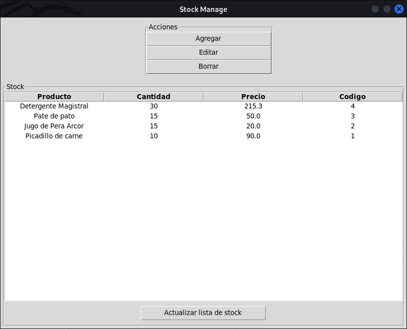
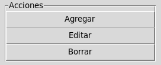
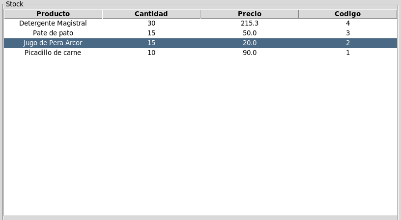
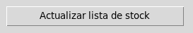

# stockManage
This program will help you to manage your stock.

 * All proyect is develpment in python with tkinter.
 * The proyect use database sqlite3
 * This is the firs version free of Stock manager

 ## Images ilustratives of program.
 

 1. From actions you can choice what do
 

 2. You can see your products in the list.
 

 3. Also you can refresh data from data base.
 

 ## This software is in develpment. But the basic functions you can use.

For questions or recommendations. You can contact me.
LinkedIn: [Ricardo Benitez]( www.linkedin.com/in/roseabdev)
